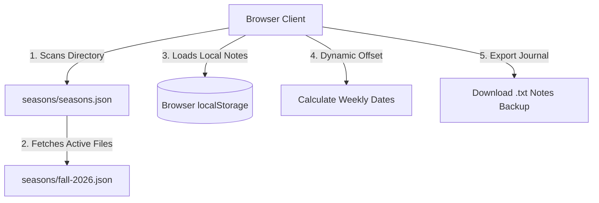

# 🛡️ Men's Study Hub (Serverless SWA Edition)

Welcome to the **Men's Study Hub**—a premium, responsive, and lightweight study companion designed to host Small Group study outlines, scriptures, discussion guides, and interactive notebooks.

This platform is structured specifically for S static site hosting. It has **zero backend servers, zero databases, and zero authentication overhead**, making it lightning-fast, 100% secure, and virtually free to host!

---

## ⚡ How It Works (The Serverless Architecture)

The system is built as a **fully static client-side single-page application (SPA)** that runs entirely in the browser:



1. **Static JSON Directory Fetching**: Upon boot, the Javascript engine reads `/seasons/seasons.json` to find which studies are available, and then loads their detailed outlines (such as `/seasons/fall-2026.json`) dynamically.
2. **Local Notebook Storage**: Personal discussion notes, prayer requests, and thoughts are kept completely secure and private inside the user's browser via native `localStorage`. No data is ever sent to a third-party server.
3. **Dynamic Date Offsetting**: Instead of hardcoding static calendar dates for each week, the engine takes a single `"startDate"` parameter (e.g., `"2026-09-23"`) and calculates the local, timezone-safe chronological date for every week in 7-day increments.

---

## 💎 Key Features

* 📊 **Completion Progress Indicator**: Displays a glowing progress meter showing what percentage of the current study outline has written reflections.
* ✍️ **Debounced Autosaving**: Automatically saves journal entries as the user types, with a subtle saved indicator badge.
* 📥 **Notebook Text Exporter**: Members can back up or compile their entire study journal as a beautifully formatted plain-text document (`.txt`) with one click.
* 🌓 **Progressive Multi-Theme Toggle**: Responsive Light & Dark modes that match user preferences or system-wide overrides instantly.
* 📋 **One-Click Scripture Copy Tool**: Instant clipboard utility to copy verse citations.
* 🖨️ **Print-Ready Notebook Sheets**: Custom `@media print` stylesheets automatically strip background grids and wrap text fields, turning digital notes into perfectly formatted physical papers.

---

## 📅 How to Add a New Study Series

To add a new study series to your website, you do **not** need to touch any HTML or JS code. Simply add a new `.json` file to the `/seasons` directory and list it in the index file!

### Step 1: Register the new file in `/seasons/seasons.json`

Open `seasons/seasons.json` and append your new study to the array:

```json
[
  {
    "id": "fall-2026",
    "file": "fall-2026.json",
    "title": "Fall 2026",
    "theme": "Strategic: To be forewarned is to be forearmed"
  },
  {
    "id": "spring-2027",
    "file": "spring-2027.json",
    "title": "Spring 2027",
    "theme": "Steadfast: Standing Strong"
  }
]
```

### Step 2: Create your study JSON file (e.g., `/seasons/spring-2027.json`)

Use the following premium JSON schema format:

```json
{
  "id": "spring-2027",
  "title": "Spring 2027",
  "theme": "Steadfast: Standing Strong",
  "startDate": "2027-03-05",
  "description": "An overview of what this series will explore in small groups...",
  "weeks": [
    {
      "number": 1,
      "title": "Week 1: Character & Theme Title",
      "scripture": {
        "reference": "2 Corinthians 12:9",
        "text": "But he said to me, 'My grace is sufficient for you...'"
      },
      "outline": [
        "First teaching outline bullet point.",
        "Second teaching outline bullet point."
      ],
      "questions": [
        "First Small Group discussion question?",
        "Second Small Group discussion question?"
      ],
      "resources": [
        {
          "name": "Sermon Title or Reading Name",
          "url": "https://youtube.com/..."
        }
      ]
    }
  ]
}
```

---

## 🚀 Hosting on Azure Static Web Apps (SWA)

Since the website consists entirely of static assets (`index.html`, `app.js`, `data.js`, `style.css`, and the `/seasons` folder), it is a perfect match for **Azure Static Web Apps**.

### Quick Deployment Steps:

1. **Push your code to GitHub or Azure DevOps**.
2. **Create a Static Web App in the Azure Portal**:
   * Search for **Static Web Apps** in the Azure Portal search.
   * Click **Create**.
   * Link your repository and branch.
3. **Configure Build Details**:
   * Set **Build Presets** to `Custom`.
   * **App location**: `/` (or your root path).
   * **Api location**: Leave empty (no backend API needed).
   * **Output location**: `/` (since we are not compiling, Azure will serve directly from the workspace root).
4. **Deploy**: Azure will automatically set up a GitHub Actions workflow and deploy your site in under 2 minutes!

---

## 🛠️ Local Development & Off-line Fallback

If you are running the project locally using `file://` protocol or are completely offline:
*SWA features a failsafe fallback mechanism in `data.js`. If the browser is blocked from fetching local JSON files due to CORS rules on `file://`, the application will automatically fallback to loading pre-seeded layouts loaded on `window.INITIAL_STUDY_DATA`!*

To run a lightweight local dev server:
```bash
npx live-server
```
or
```bash
python3 -m http.server 8000
```
